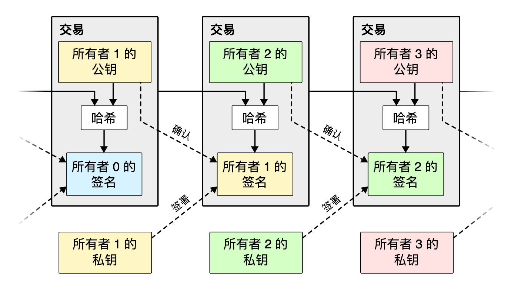
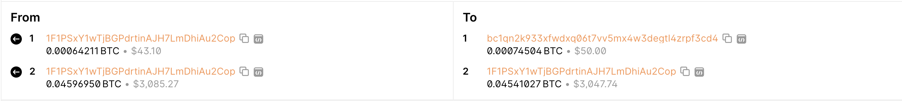

本文主要记录比特币白皮书的学习过程，中间涉及到一些学习时想到的问题，一并记录在此。

## 概要（几句话简单介绍了比特币的特性）

**不可更改**：点对点交易网络通过给交易加上时间戳，方法是将交易哈希到一个基于哈希的工作量的持续链上。除非全部重做否则不可更改。

**安全性**：只要大多数计算能力掌握在[诚实节点](https://www.notion.so/7454aff5bc1f47ab89aaec1a9ac412ae?pvs=21)手中，她们就会生成[最长链](https://www.notion.so/2a8618c97e484ca19ae963ef7f485ef7?pvs=21)，从而超过攻击者。（抵抗“51%攻击”的方法）

**灵活性**：节点可以随时离开和加入，重新加入时会同步最长链中的信息。

## part1（介绍要解决的问题以及提出解决方案）

### 需要解决的问题

传统金融机构因为信任问题无法进行不可逆的交易（因为面临仲裁风险），也无法为真正不可逆的服务提供不可逆的交易。

传统交易过程需要依靠信任第三方（银行、支付公司等）进行，可能会带来安全性问题和高额手续费的问题。

### 解决方案

提出了一个基于密码学证明而非基于信任的点对点交易系统，并且保护交易双方。

1. **计算上难以逆转的交易保护卖方**
    - **方法**：利用区块链技术，特别是通过工作量证明（PoW）或其他共识机制，确保交易记录一旦被确认就不可逆转。
    - **好处**：防止买方在收到商品或服务后恶意逆转交易，确保卖方能够安全收到付款。
2. **托管机制保护买方**
    - **方法**：引入第三方托管服务，或在区块链上使用智能合约。买家的支付先存入托管账户，只有在确认收到满意的商品或服务后，托管方才会将资金释放给卖家。
    - **好处**：保障买方在交易中的权益，防止卖方发出不符合要求的商品或服务，并在发生争议时提供公平的调解。

## part2 交易（工作原理和存在的问题）

### 工作原理

1. **数字签名和哈希**：每个比特币拥有者在将比特币传输给下一个所有者时，会对前一次交易的哈希值以及下一个所有者的公钥进行数字签名。哈希值是前一次交易的摘要，用来确保交易的唯一性和不可篡改性。数字签名是拥有者用自己的私钥对交易进行签名，以证明交易是由真实的拥有者发起的。
2. **链式结构**：每次交易都会将前一次交易的哈希值和新的所有者的公钥添加到比特币的尾部，形成一个交易链。这样的设计使得每个比特币的所有权变迁可以被追溯到最初的发起者。
3. **验证链条**：任何收款人都可以通过验证每个交易中的数字签名来验证比特币的链条，确保交易的有效性和所有权的合法性。这意味着每个拥有者都无法伪造交易，因为伪造的交易将无法通过数字签名的验证。

### 存在的问题——无法验证双重支付问题double- spending

如何确保所有参与者在交易记录或事件顺序上达成一致？

比特币采用的是poW（工作量证明）共识机制。以太坊正在转向poS（proof of Stake 权益证明）共识机制。

## part3 时间戳服务（解决双重支付验证问题）

- 会不会存在同一笔资金在同一个时间戳下被支付到两个地方这种情况？

    在区块链技术中，同一笔资金在同一个时间戳下被支付到两个地方是不太可能的，因为这违反了区块链的共识规则和加密货币的基本原则。以下是一些原因：

    1. **先来先服务（First-come, First-served）**：在区块链网络中，只有第一个获得网络确认的交易才会被视为有效。如果两笔交易几乎同时被创建并广播到网络中，只有一笔交易会被首先包含在区块中，而另一笔交易则会被拒绝。
    2. **双重支付检测**：区块链节点会验证交易的有效性，其中包括检查交易是否尝试双重支付。如果有两笔交易试图在同一个时间戳下使用相同的资金，网络将拒绝其中一笔交易，并只接受第一笔被确认的交易。
    3. **智能合约约束**：在某些区块链平台上，如以太坊，智能合约可以编写规则来限制资金的使用方式。通过智能合约，可以实现各种复杂的交易规则和约束条件，包括防止双重支付。

    虽然在理论上可能存在两笔交易几乎同时被确认的情况，但在实践中，区块链网络的共识算法和双重支付检测机制通常会有效地防止这种情况的发生。因此，同一笔资金在同一时间戳下被支付到两个地方的可能性非常小。

### 生成方式

> A timestamp server works by taking a hash of a block of items to be timestamped and widely publishing the hash
>

将一组记录的哈希值作为时间戳，并广泛发布这个哈希值。

- 时间戳的作用？

    在区块链或其他加密学应用中，时间戳通常与数据的哈希值结合在一起，以确保数据在特定时间点的存在性和完整性。以下是更详细的解释：

    1. **数据完整性**：哈希函数将数据转换为固定长度的唯一哈希值。即使数据发生微小的改变，其产生的哈希值也会完全不同。因此，通过存储数据的哈希值，可以有效地验证数据的完整性，因为只要数据保持不变，它的哈希值也将保持不变。
    2. **时间戳的作用**：将时间戳与数据的哈希值结合在一起可以证明该数据在特定时间点之前已经存在。这是因为在计算哈希值之前，数据已经被添加了时间戳信息，因此哈希值反映了数据在添加时间戳之后的状态。
    3. **防止篡改**：时间戳的引入可以防止数据被未经授权地篡改。因为任何尝试更改数据的行为都会导致哈希值的变化，从而破坏了数据的时间戳证明。
    4. **应用场景**：时间戳和哈希值的组合在许多领域都有广泛的应用，例如区块链中的交易记录、数字证书的验证、电子文档的完整性保护等。通过将时间戳和哈希值相结合，可以提供可靠的数据完整性验证和时间顺序证明。

    总之，时间戳确实证明了数据在特定时间点的存在，而哈希值则提供了数据完整性的验证。将这两者结合在一起可以构建出强大的安全机制，适用于许多不同的加密学和信息安全应用场景。

时间戳证明了数据在特定时间点存在，否则无法生成哈希值。

## part4 工作量证明（proof of work）

工作量证明去找一个满足条件的哈希值——寻找一个前n位数为0的哈希值。因为哈希值的前n位每增加一个0，工作量就会以指数级增长。

时间戳网络通过给区块中添加一个随机数来计算这个区块的哈希，如果能计算出满足条件的哈希值，这个区块就会被添加到链上。（消耗CPU）

自然而然的最长的链代表了最多的工作量，也就最可信。

## part5 网络（交易信息如何被打包进链的过程）

1. 一组交易信息被广播到所有节点
2. 每个节点都给这组交易信息分配一个块
3. 每个节点都开始给这个块进行工作量证明的运算
4. 当一个节点找到了符合工作量证明的值，它就被广播到所有其他的节点
5. 其他的节点都会接受这个块的信息，前提是这些交易信息是有效的并且没有被重复花费过。
6. 其他节点接受了这个块的信息会表现为：在创造下一个新块时，用接受的块的信息计算这个新块的“前块哈希”。

- 区块链中的node和block的区别是什么 ？

    在区块链中，"node" 和 "block" 是两个不同的概念，它们代表了区块链网络中的不同组成部分和数据结构。以下是它们之间的区别：
    1. **Node（节点）**：
        ◦ 节点是区块链网络中的一个参与者，可以是一个计算机或者一组计算机。
        ◦ 节点可以是全节点（Full Node）或者轻节点（Light Node）。
        ◦ 全节点是一个完整的区块链网络的副本，存储了区块链上的全部数据，并能够验证和广播交易。
        ◦ 轻节点通常只存储区块链的部分数据，依赖于全节点或者其他节点来获取和验证数据。
        ◦ 节点在区块链网络中起到了验证、转发和存储数据的作用，是网络的基础组成单位。
    2. **Block（区块）**：
        ◦ 区块是区块链中的一个数据单元，用于存储一定数量的交易数据。
        ◦ 每个区块包含了前一个区块的哈希值（指向上一个区块）、一组交易数据、时间戳和其他元数据。
        ◦ 区块通过哈希值相互链接，形成了一个不可篡改的链式结构，称为区块链。
        ◦ 区块是区块链中的基本构建单元，用于记录和存储交易数据，同时也用于确保区块链的安全性和完整性。
    综上所述，"node" 是区块链网络中的参与者和数据处理节点，而 "block" 则是区块链中存储和记录交易数据的基本单位。节点负责验证、转发和存储区块链数据，而区块则用于记录和组织这些数据，并确保整个网络的稳定运行。

## part6 奖励

每打包一个新的币会获得奖励，打包也会获得手续费。当所有的比特币流通出来后，手续费就会变成主要的奖励了。

奖励机制可以促使节点保持诚实。

- 什么是诚实节点？

    在区块链领域，节点保持诚实指的是节点遵守网络规则和协议，按照共识机制的规定进行操作，并不进行任何恶意或违规的行为。这包括但不限于以下几个方面：
    1. **验证交易**：节点负责验证新交易的有效性，并确保它们符合网络的规则，如双重支付检测、地址格式检查等。
    2. **打包区块**：矿工节点负责将验证通过的交易打包成新的区块，并按照共识规则添加到区块链中。
    3. **保护私钥**：节点保护自己的私钥，不会将其泄露给他人或用于恶意行为，以确保交易的安全性和隐私性。
    4. **遵守共识规则**：节点遵守区块链的共识规则，如工作量证明（PoW）、权益证明（PoS）等，不会试图篡改区块链的历史记录或者控制网络的大部分算力。
    5. **维护网络**：节点保持良好的网络连接和稳定的运行状态，及时同步最新的区块链数据，并将其传播给其他节点。
    总的来说，节点保持诚实是指节点遵守区块链网络的规则和协议，不进行任何违反规则或恶意行为，以维护网络的安全性、可靠性和稳定性。这种诚实行为是区块链网络运行的基础，对于整个网络的健康发展至关重要。

- 不诚实的节点会有哪些行为？

    1. **双重支付**：一个节点可能尝试发送同一笔资金给多个接收方，即进行双重支付。这种行为可能是出于欺诈目的，试图花费同一笔资金两次。
    2. **无效交易验证**：节点可能会故意验证无效的交易，如花费不存在的资金或者尝试执行非法操作。这种行为可能导致网络混乱和不稳定。
    3. **无效区块生成**：矿工节点可能会尝试创建包含无效交易或者违反共识规则的区块，并试图将其添加到区块链上。这种行为可能会导致区块链分叉或者网络的分裂。
    4. **私钥泄露**：节点持有者可能会泄露私钥给他人，或者将私钥用于恶意目的，如盗取资金或者篡改交易历史。
    5. **攻击性行为**：节点可能会试图执行各种形式的网络攻击，如拒绝服务攻击（DDoS）、51%攻击等，以破坏网络的正常运行。
    6. **共识规则违反**：节点可能故意违反共识规则，如通过控制大部分算力来执行双重支付或者进行交易审查，以达到控制网络或者获取不当利益的目的。
    以上是一些节点可能不诚实的行为，这些行为可能会导致区块链网络的不稳定、不安全甚至崩溃，因此需要网络中其他节点的监督和制约，以确保网络的安全性和可靠性。

## part7 回收空间

- 一个node能包含多少个block ？

    在一个典型的区块链网络中，一个节点（或者说一个矿工）在某一时刻可以创建多个区块，但这些区块通常不会立即被网络中的其他节点接受为有效的。这是因为区块链网络中的共识机制规定了新区块的添加方式，通常要求节点只接受链上的最长有效链，并在添加新区块时遵循一定的规则和约定。具体来说，在比特币等一些 PoW（Proof of Work）机制的区块链网络中，一个节点通常只能在上一个区块的基础上创建一个新的区块。这是因为在 PoW 机制下，节点需要通过解决数学难题来竞争创建新的区块，而这个过程是基于上一个区块的信息的。因此，一个节点在某一时刻只能创建一个有效的区块。但是，在一些特殊情况下，比如网络分叉或者双花攻击等情况下，可能会出现一个节点创建了多个区块的情况。这种情况下，网络中的其他节点会选择其中一个区块添加到链上，并且将其他区块视为无效。因此，**实际上，在大多数情况下，一个节点只会创建一个有效的区块，并将其添加到区块链网络中。**

一旦一枚加密货币中的交易被足够多的节点确认了，在该交易之前已经被确认花费的交易就可以被删除，用以节省磁盘空间。

- 什么是被确认花费的交易？如何确认交易是否被花费？

    在区块链中，每个交易都有一个唯一的交易ID，并且每个输入都引用了之前的交易的输出。如果一个交易的输入引用了之前已经被花费的交易的输出，那么这个交易就被认为是已经被花费的。在区块链中，每个交易的输出可以被作为另一笔交易的输入来使用，但每个输出只能被使用一次。因此，一旦一个输出被用作了某笔交易的输入，它就被认为是已经被花费的。区块链上的所有未花费的交易输出被称为UTXO（未花费的交易输出）。通过跟踪UTXO集合，可以确定哪些交易是已经被花费的，哪些是尚未被花费的。为了区分交易是否被花费，可以根据交易的输入来进行检查。如果一个交易的输入引用了一个已经被包含在区块链上的交易的输出，那么这个交易就被认为是已经被花费的。如果一个交易的输入引用的是一个尚未被包含在区块链上的交易的输出，那么这个交易就被认为是尚未被花费的。

- 区块的生成，对cpu要求高，对存储空间要求相对小 ？

    在区块链中，区块的生成通常对计算资源（尤其是CPU）的要求较高，而对存储空间的需求相对较小。

    1. **计算资源要求高**：区块的生成通常需要进行复杂的计算工作，特别是在采用了工作量证明（Proof of Work，PoW）或其他类似的共识机制的区块链网络中。在PoW中，矿工需要解决一个复杂的数学难题才能生成新的区块，这需要大量的计算资源（主要是CPU）来进行计算。因此，区块的生成对计算资源的要求是相对较高的。
    2. **存储空间需求相对较小**：虽然区块链中的区块会增长并且需要持续存储，但是相比于区块的生成过程，存储空间的需求相对较小。尤其是对于只存储区块头而不包含交易内容的情况，存储空间需求更为有限。此外，随着技术的进步和存储成本的降低，存储空间的需求通常不会成为区块链系统的主要限制因素。

    总的来说，区块的生成对计算资源的要求较高，而对存储空间的要求相对较小。这也是为什么在许多区块链系统中，矿工通常需要投入大量的计算资源来参与区块的生成，而存储空间通常并不是一个主要的限制因素。

## part8 简化版支付确认

验证一比交易是否已经被确认，不需要下载完整的整个链，只需要拥有一份最长链的区块头拷贝即可。

[举个例子 (1)](https://www.notion.so/1-4834d1dc657043a2897b1a9a7e9ba4fa?pvs=21)

## part9 价值的组合与分割

一笔交易可以有多个输入和多个输出。输入可以是1比较大的金额，也可以是多比小额金额；输出最多有2个，一个是支付，另一个是找零。

## part10 隐私

比特币通过将交易信息公开，但是并不知道交易者双方的信息，来实现对隐私的保护。类似股票交易所。

## part11 计算（略过）

## part12 结论

We have proposed a system for electronic transactions without relying on trust. We started with
the usual framework of coins made from digital signatures, which provides strong control of
ownership, but is incomplete without a way to prevent double-spending. To solve this, we
proposed a peer-to-peer network using proof-of-work to record a public history of transactions
that quickly becomes computationally impractical for an attacker to change if honest nodes
control a majority of CPU power. The network is robust in its unstructured simplicity. Nodes
work all at once with little coordination. They do not need to be identified, since messages are
not routed to any particular place and only need to be delivered on a best effort basis. Nodes can
leave and rejoin the network at will, accepting the proof-of-work chain as proof of what
happened while they were gone. They vote with their CPU power, expressing their acceptance of
valid blocks by working on extending them and rejecting invalid blocks by refusing to work on
them. Any needed rules and incentives can be enforced with this consensus mechanism.
把所有的概念串联起来的一段话，我觉得说的非常精辟，因此引用原文并翻译如下：

我们提出了一个不用基于信任的电子交易系统。我们从一个普通的硬币框架开始，这个框架来自于数字签名，它提供了对所属权强有力的控制，不过实现它的前提是要避免双重花费问题。为了解决这个问题，我们提出了一个点对点网络，该网络使用工作量证明来记录公开的历史交易，并很快成为只要绝大多数的算力被诚实节点掌握就不可能从算力上被攻击者改变的系统。这个网络因为其非结构性的简单而强大。节点同时工作几乎不需要协调。他们不需要被识别，因为消息不用发送到其他特定的地方，只需要尽力的被传递就行。节点可以按照意愿离开或者重新加入网络，当它们走的时候的时候接受工作量证明链作为证据。他们用算力进行投票——通过延长块来表达他们对有效块的接受，通过拒绝延长来拒绝无效的块。所有需要的规则和奖励都可以通过这种共识机制来执行。
